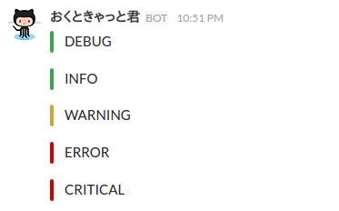

# colored\_slack\_log\_handler

[](https://travis-ci.org/shibataka000/colored_slack_log_handler)

Python color-coding Slack log handler.

## Requirement
- requirements
- logging

## Usage
```python
# coding: utf-8

import logging
from colored_slack_log_handler import SlackHandler

webhook_url = "https://hooks.slack.com/services/AAA/BBB/CCC"  # URL of Slack Incoming Webhook

logger = logging.getLogger(__name__)
logger.setLevel(logging.DEBUG)

slack_handler = SlackHandler(webhook_url)
logger.addHandler(slack_handler)

logger.debug("DEBUG")
logger.info("INFO")
logger.warn("WARNING")
logger.error("ERROR")
logger.critical("CRITICAL")
```



## Install
```
pip install colored_slack_log_handler
```

or

```
python setup.py install
```

## Author
[shibataka000](https://github.com/shibataka000)
